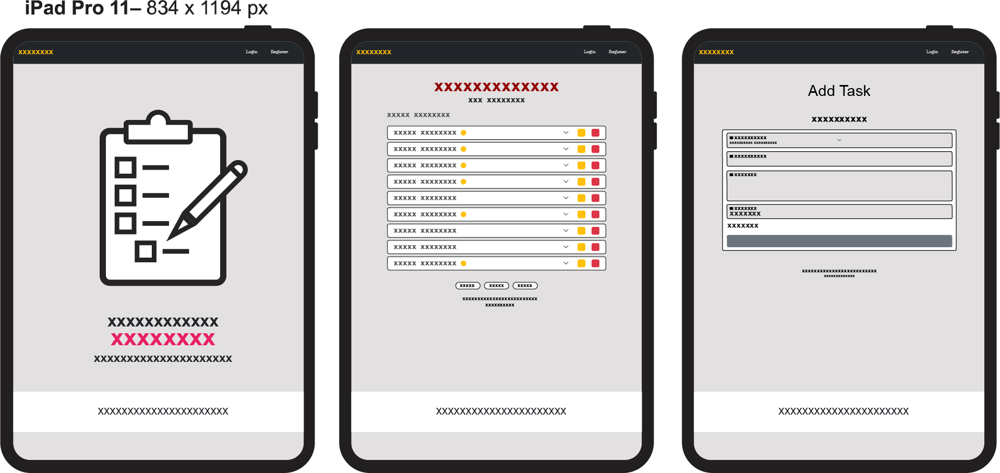
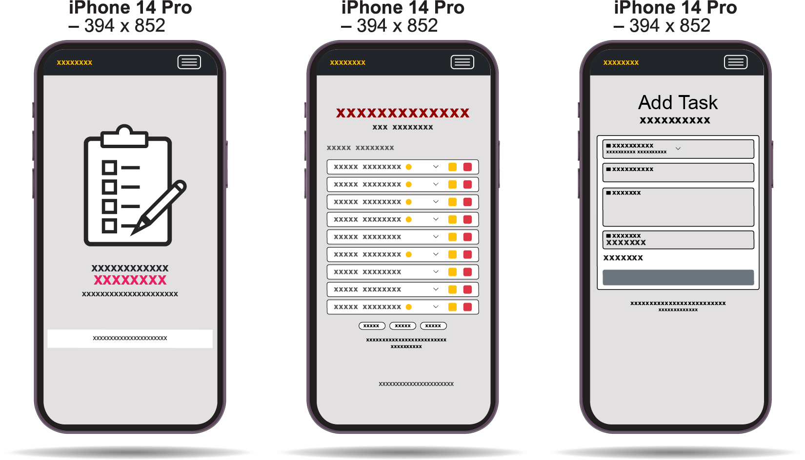
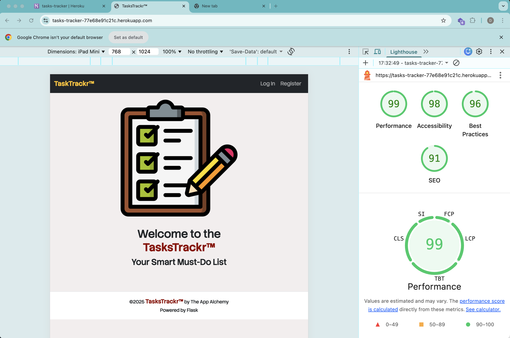

# TasksTrackr – Milestone Project 3 (Data-Centric Development)

TasksTrackr is a full-stack, data-centric task management web application built with Flask, MongoDB, HTML, CSS, Bootstrap 5, and JavaScript. The system enables users to manage tasks, monitor deadlines, and identify urgency using a RAG (Red–Amber–Green) priority model. Superadmins can administer users, categories, and tasks through a role-based access control (RBAC) structure.


[Live webpage](https://tasks-tracker-77e68e91c21c.herokuapp.com)

## Table of Contents
1. Project Overview
2. UX / UI Design
3. Features
4. Data Model
5. Technologies Used
6. Testing
7. Deployment
8. Security Considerations
9. Deployment
10. Future Improvements
11. Development Challenges and Resolutions
12. Credits

## 1. Project Overview
TasksTrackr is a data-driven productivity platform designed to organise personal and professional workloads. Users can create, update, delete, and filter tasks, while the system dynamically calculates urgency using a RAG traffic-light model derived from each task’s due date.

The backend logic is handled by Flask, persistent storage is managed via MongoDB Atlas, the interface is delivered using Bootstrap 5, and user authentication is secured through Flask sessions and password hashing.

The development of TasksTrackr is driven by the need for a clear, practical, and data-centred solution that helps users organise their daily responsibilities in an efficient and accessible way. In modern working and learning environments, individuals frequently manage multiple priorities across both personal and professional domains. Without a structured system, tasks are easily forgotten, deadlines are missed, and productivity becomes inconsistent. This project aims to address these challenges through a tool that is intuitive, secure, and supported by real-time data.

**Purpose & Value**

The primary purpose of TasksTrackr is to provide users with a simple yet powerful platform for managing tasks, visualising priority levels, and staying organised across all areas of life. Many existing task managers are either too complex for beginners or too limited for users who need meaningful oversight. This project fills that gap by combining ease of use with practical features such as category grouping, due-date tracking, and automated RAG (Red–Amber–Green) priority calculation based on real data.

-  Provide an intuitive, role-aware task management solution.
-  Support individual contributors, administrators, and superadmins.
- Deliver rapid task entry, filtering, visual urgency indicators, and administrative controls (user management, category management, and global task oversight).
  
The system supports both everyday users and administrative roles. It delivers fast task entry, a clean interface, and a strong focus on clarity—allowing users to see exactly what needs attention the moment they log in.

## 2. UX / UI Design
###  User Goals
- Create and manage tasks with minimal friction.
- View deadlines and priorities at a glance.
- Access the system across devices using a responsive interface.


###  Project Goals
- Demonstrate full-stack CRUD functionality.
- Implement secure authentication and session management.
- Showcase data-dependent RAG calculations.

###  Design Features
- Responsive Bootstrap 5 layout supporting desktop, tablet, and mobile.
- Colour-coded category badges and dynamic RAG labels.
- Minimalist dashboard with accordion-based task display.

### Wireframes
<details><summary>Desktop</summary>

</details>
<details><summary>Tablet</summary>

</details>
<details><summary>Phone</summary>

</details>

### Target Audience

- **Individuals**
People managing household responsibilities, errands, personal projects, or general life tasks who need a central place to stay organised.
- **Busy Professionals.**
Individuals working in office environments, healthcare, IT, education, or customer-facing roles who manage multiple responsibilities and need a structured tool to stay on top of daily tasks.
- **Students and Learners.**
Learners balancing classes, assignments, revision deadlines, and personal commitments who require a clear structure to avoid missed work.
- **Freelancers and Self-Employed Workers.**
Designers, writers, developers, consultants, and gig workers who need to keep track of client projects, delivery dates, and personal workloads.
- **Parents and Home Managers.**
Individuals managing family schedules, home tasks, appointments, bills, and personal activities who benefit from a simple, centralised system.
- **Small Teams or Community Groups.**
Small organisations, clubs, volunteer groups, or project teams that need to coordinate tasks, deadlines, and responsibilities.
- **Individuals with Organisation or Time-Management Challenges.**
People who struggle with planning, remembering deadlines, or staying focused and benefit from clear visual cues like RAG priority indicators.
- **People Who Prefer Digital Productivity Tools.**
Users who enjoy structured, digital task management rather than paper planners, sticky notes, or unorganised spreadsheets.


### User Stories
#### What I need to know as a First-time User
- As an individual using the app for the first time, I need to know how to add a task quickly so I can immediately start organising my day without confusion.
- As a student who is new to the app, I need to understand how the RAG colours work so I can instantly see which assignments or deadlines are most urgent.
- As a professional logging in for the first time, I need to know how to categorise my tasks clearly so I can separate work priorities and manage multiple projects effectively.

#### What I need to know as Returning Customer
- As a returning individual user, I want to instantly see which tasks are urgent so I can plan my day without feeling overwhelmed.
- As a returning individual user, I want to pick up where I left off so I can continue completing my personal tasks without redoing anything.
- As a returning student, I want to view all upcoming deadlines at a glance so I don’t fall behind on assignments or revision.
- As a returning student, I want to update my tasks quickly so I can adjust my workload whenever my study schedule changes.
- As a returning professional, I want the dashboard to show today’s critical work tasks so I can manage my workload efficiently.
- As a returning professional, I want to revise tasks or deadlines easily so I can adapt to changes in my projects or responsibilities.
  


## 3. Features
**User Authentication**
- Registration, login, logout.
- Password hashing; freeze after 3 failed logins.
- Password reset tokens.
- Session-based access control.

**Task Management (CRUD)**
- Create, edit, delete tasks.
- Filter tasks by category.
- RAG-based urgency highlighting:
  - Green: ≥3 days remaining
  - Amber: <48 hours
  - Red: Due or overdue
Owner-controlled editing; deletion allowed by owner or superadmin.

**RAG Status System**

Urgency is automatically computed from the due date using datetime logic. Output dynamically updates within the UI.

**Admin / Superadmin Features**
- Promote/demote users.
- Freeze/unfreeze accounts; view failed login attempts.
- Delete any user or task (except self/superadmins).
- Create categories; deletion restricted if in use.
- System-wide visibility of all tasks.

**Planned Enhancements**
- Email reminders for overdue tasks.
- Calendar integration and recurring tasks.
- Drag-and-drop UX improvements; dark mode.
- Mobile-ready API endpoints.
- Customisable RAG thresholds per user.

## 4. Data Model (MongoDB)
**Collections & Key Fields**

**users**
- username (string, lowercase, unique)
- password (hashed)
- role (user | admin | superadmin)
- is_frozen (bool)
- failed_logins (int)
- reset_token (string)
- reset_expires (datetime)

**tasks**
- task_name (string)
- task_description (string)
- category_name (string)
- is_urgent ("on"/"off")
- due_date (YYYY-MM-DD string)
- created_by (string username)

**categories**
- category_name (string, unique recommended)

**Notes**
- Relationships are maintained via string references.
- For production:
  - Add indexes on usernames, categories, due_date, and created_by.

  - Consider using ObjectId references for categories to enforce integrity.

### Data and Information Considerations
The application is built around a data-centric architecture, using MongoDB Atlas to store and manage:
Users (authentication, roles, account status)
Tasks (task name, description, due date, category, urgency)
Categories (logical grouping of tasks)
The data model enables fast retrieval, flexible querying, and clear relational mapping between users and their tasks. The automated RAG logic is entirely data-driven, relying on dates stored in the database to dynamically classify urgency levels. This ensures the interface reflects real-time task status without requiring user input beyond the due date.

## 5. Technologies Used
- **Frontend:** HTML5, CSS3, Bootstrap 5, JavaScript.
- **Backend:** Flask, Jinja2, Flask-PyMongo.
- **Database:** MongoDB Atlas.
- **Other:** Werkzeug (password hashing), Git/GitHub, Heroku (deployment target).

## 6. Testing
A detailed manual test plan is provided in TESTING.md, covering:
- Authentication flows
- CRUD functionality
- RAG status logic
- Admin governance functions
- Responsive design
- Accessibility checks
- Data integrity (MongoDB operations)

## Additional validations:

### HTML Validation tested with W3C validators
<details><summary>HTML</summary>

</details>

### CSS Validation tested with W3C validators
<details><summary>style.css</summary>

</details>

Python code syntax validated via:
    - python3 -m py_compile app.py
flake8 app.py

### Performance
Google Lighthouse in Google Chrome Developer Tools was used to test the performance of the website.
<details><summary>Performance Test on Lighthouse</summary>

</details>

###  Performing tests on various devices
The website was tested on the following devices:

-  Imac 24-inch M1 2021
-  Ipad Pro 11 2021
-  Apple Iphone 14 Pro

In addition, the website was tested using Google Chrome Developer Tools Device Toggeling option for all available device options.

### Browser compatibility
The website was tested on the following browsers:
-  Safari
-  Google Chrome
-  Mozilla Firefox
-  Microsoft Edge
  
## 7. Deployment
- Prerequisites
- Python 3.x
- pip and virtual environment tools
- Valid MongoDB URI
- Environment variables: MONGO_URI, SECRET_KEY, IP, PORT

**Installation**
 - python3 -m venv .venv
- source .venv/bin/activate
- pip install -r requirements.txt

**Running the Application**
- python3 app.py

  (Debug mode disabled by default; enable locally if required.)

**Superadmin Configuration**
- Set role and status fields manually in MongoDB:
- role: "superadmin"
- is_frozen: false
- failed_logins: 0


## 8. Security Considerations
Security is an essential part of the system’s design, especially when handling personal task information and account details. The following measures were implemented:

**1. Secure Authentication**

Passwords are never stored in plain text. The system uses Werkzeug’s industry-standard hashing to protect user credentials.

**2. Session-Based Access Control**

User sessions ensure that protected routes (e.g., tasks, admin features) are only accessible after login. Sessions are stored securely using a unique SECRET_KEY.

**3. Role-Based Access Control (RBAC)**

User actions are restricted based on roles:
-  Standard users manage only their own tasks.
-  Admins and superadmins gain elevated permissions to manage users, categories, and system governance.
  
This prevents unauthorised activity and enforces a strong permission boundary.

**4. Account Protection**

To reduce the risk of brute-force attacks:
- Accounts are automatically frozen after three failed login attempts.
- Admins can unfreeze accounts, ensuring accountability and oversight.
  
**5. Secure Database Handling**

The MongoDB URI is stored in environment variables, never in the source code.

This protects sensitive connection credentials and prevents accidental exposure in public repositories.

**6. Data Validation**

Server-side validation prevents malicious input, ensures task integrity, and reduces the risk of malformed or insecure data entries.

- Passwords hashed (Werkzeug); sessions for auth.
- Account freeze after 3 failed logins; superadmin can unfreeze.
- Role-guarded routes (superadmin-only admin UI/actions).
- Reset tokens with 1-hour expiry (link flashed; no email transport in this build).
- Delete guarded: owner/superadmin; admin view delete for any task.

## 9. Deployment
1) **Prerequisites:** Python 3.x, pip/virtualenv; MongoDB URI.  
2) **Install deps:**
   ```bash
   python3 -m venv .venv
   source .venv/bin/activate
   pip install -r requirements.txt
   ```
3) **Env vars:** `MONGO_URI`, `SECRET_KEY`, `IP`, `PORT` (export or `.env`).  
4) **Run:** `python3 app.py` (debug=False by default).  
5) **Superadmin:** set `role: "superadmin"` (and `is_frozen: false`, `failed_logins: 0`) on a user in Mongo, then use Admin UI.

## 10. Future Improvements
- Email/SMS delivery for reset tokens and alerts.
- Robust ownership enforcement on task editing.
- Additional database indexes and schema validation.
- Automated tests with coverage reporting.
- Calendar/scheduler integration.
- Recurring tasks and personalised RAG thresholds.


## 11 Development Challenges and Resolutions
### Problem 1: Flask–MongoDB Connection Failure
- The first and most significant challenge I encountered was establishing a reliable connection between Flask and MongoDB Atlas. I spent two days troubleshooting—searching social media posts, YouTube tutorials, and various online forums—but no solution worked.
I eventually sought support from Code Institute’s tutoring service. Tom explained that Flask-PyMongo has changed substantially since version 3, and many online examples (including the connection string from MongoDB Atlas) no longer work without adjustments. After reviewing my configuration, he identified the issue within the connection URI and instructed me to modify it by replacing the deprecated parameter with  "&tlsAllowInvalidCertificates=true."

Once updated, Flask-PyMongo connected successfully.  This issue would have been extremely difficult to resolve independently, and the tutor’s guidance was essential in unblocking my progress.

### Problem 2: Bootstrap Navbar Not Responding
- Another major challenge occurred when my Bootstrap navbar and accordion stopped functioning. After extensive trial and error and reviewing online forums, I discovered that the issue stemmed from loading Bootstrap JavaScript twice—once in the <head> and again at the bottom of the <body>.

This double initialisation caused event conflicts that broke interactive components such as:
Navbar collapse
Accordion collapse
Tooltips

Reviewing the official Bootstrap documentation clarified the problem. The fix was straightforward:
- Remove the Bootstrap JS bundle from the <"head">
- Keep only the script loaded at the bottom of the <"body">
  
This ensures JavaScript loads after the HTML content, preventing broken events and restoring all interactive behaviour.

### Problem 3: Accordion Items Opening Simultaneously
- The third challenge was that all accordion items opened at the same time, despite Bootstrap’s accordion component being designed to allow only one open item by default.
  
The cause was that all accordion sections shared identical IDs (collapseOne, headingOne), which violates Bootstrap’s requirement for unique identifiers.

The solution involved:
- Assigning unique IDs using {{ loop.index }} (e.g., heading1, collapse1, heading2, collapse2, etc.)
- Setting aria-expanded="false" for collapsed defaults
- Removing the show class so no item opens automatically
- Ensuring data-bs-parent="#accordionTasks" was present so only one accordion pane opens at a time

After implementing these changes, the accordion behaved correctly, allowing only one section to expand at once.

### Problem 4: Deprecated Delete Route in Flask-PyMongo
  The final challenge involved deprecated MongoDB operations. I originally used:
  - mongo.db.tasks.remove() in my delete route
  
  However, remove() is deprecated in modern versions of PyMongo. The correct approach is to use:
- delete_one() for deleting a single document
- delete_many() for deleting multiple documents
- I learned this from watching youtube toturial on mongoDB presented by BroCode (https://www.youtube.com/watch?v=c2M-rlkkT5o&t=2799s)
  
Updating the delete route to use delete_one() resolved the issue and aligned the project with current MongoDB best practices.

## What I Learned Along the Way
**1. The Importance of Understanding Version Changes.**

One of the biggest lessons I learned was that documentation and tutorials quickly become outdated when libraries release new versions. Flask-PyMongo introduced breaking changes after version 3, which meant examples from MongoDB Atlas and online guides no longer matched the current implementation. This experience reinforced the value of always checking version-specific documentation and release notes rather than relying solely on older tutorials.

**2. Debugging Requires Methodical Investigation.**

The connection issue between Flask and MongoDB demonstrated the importance of patience and structured debugging. I learned to examine error messages closely, test assumptions one step at a time, validate environment variables, and isolate potential causes. Trial-and-error becomes productive only when paired with a deliberate method.

**3. Front-End Behaviour Depends on Proper Script Management.**

The Bootstrap issue taught me that loading JavaScript incorrectly can break an entire interface. I learned the correct script order—HTML first, then JavaScript—and gained a clearer understanding of how event-driven components rely on proper initialisation. This knowledge is essential for building stable, responsive UIs.

**4. Unique Identifiers Are Critical for Interactive Components.**

The accordion issue showed me how even small details, such as duplicated IDs, can completely disrupt functionality. I learned to generate dynamic, unique IDs using Jinja’s loop.index and to pay attention to ARIA attributes and Bootstrap’s required structure. Good UI behaviour relies on clean and predictable markup.

**5. Deprecated Code Can Lead to Silent Failures.**

The removal of MongoDB’s remove() method reinforced the need to recognise deprecated functions and adopt modern equivalents such as delete_one(). Staying updated with library changes prevents technical debt and ensures stability in production.

**6. Knowing When to Seek Help Is Part of Being a Developer.**

Reaching out to a tutor was essential in resolving an issue that would have taken much longer on my own. This experience taught me that collaboration and asking for assistance are not signs of weakness—they are part of professional practice. Effective problem-solving often involves knowing when a fresh pair of eyes can help.

**7. Documentation and Official Sources Are Essential.**

When fixing Bootstrap and MongoDB issues, I learned that official documentation is often the fastest route to accurate solutions. Community forums are useful, but authoritative references provide reliable answers that match current versions.

**8. Small Errors Can Cause Major Issues.**

From missing symbols in a URI to duplicated IDs in an accordion, I learned that attention to detail is crucial. One misplaced character or duplicated attribute can break an entire feature. This reinforced the importance of careful reviewing, validation, and incremental testing.

## 12. Credits
- Flaticon for the landing page image.
- Flask, Flask-PyMongo, MongoDB, Bootstrap, Werkzeug.
- Tutoring at Code Institute
- Code Institute for project framework guidance.
